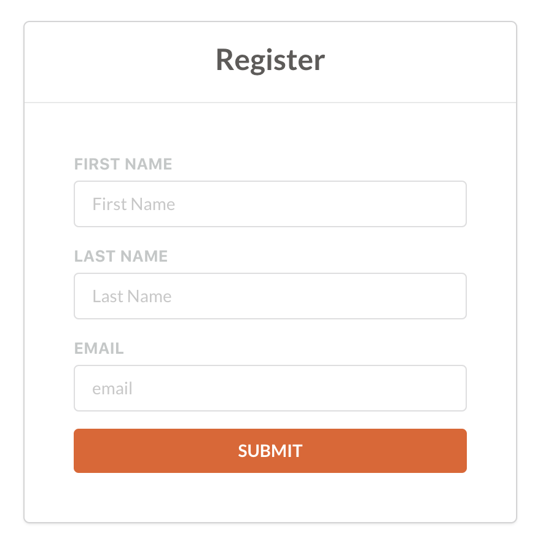
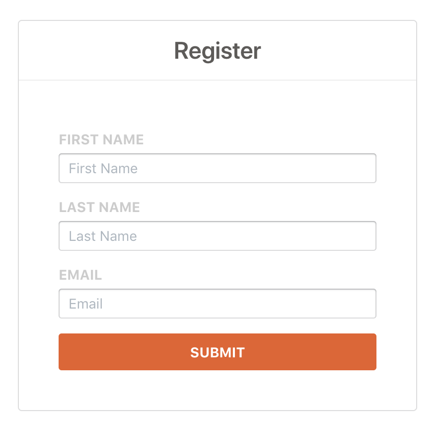
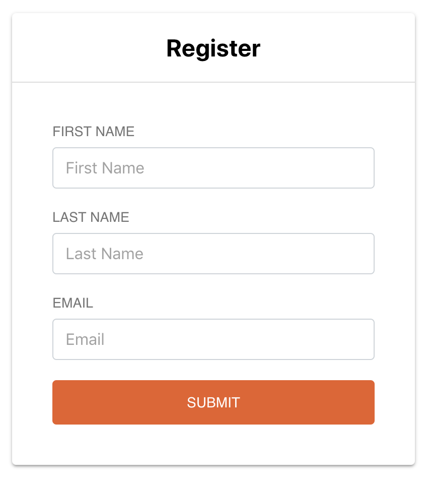
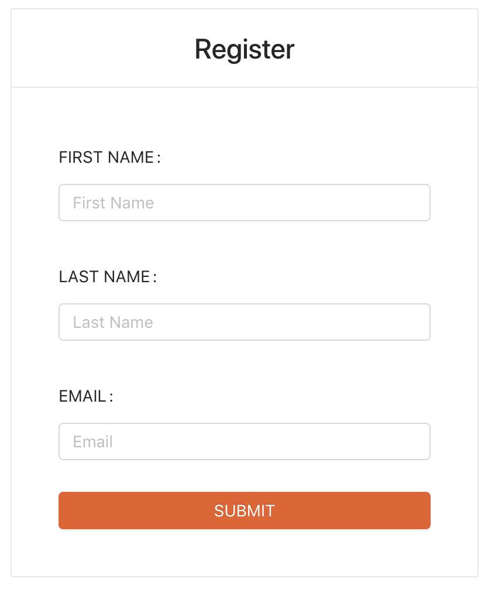

# Comparison of some well-known UI libraries

## semantic-ui-react

Github stars: 8.903 ★
base css filesize: 629 KB
Total bundle size: 236 KB

## blueprintjs
Github stars: 13.149 ★
base css filesize: 302 KB
Total bundle size: 493 KB

## material-ui
Github stars: 44.136 ★
base css filesize: N/A
Total bundle size: 252 KB

## ant-design
Github stars:
base css filesize:
Total bundle size:

## UI comparison
(After some customization)

### semantic-ui-react

### blueprintjs

### material-ui

### ant-design
